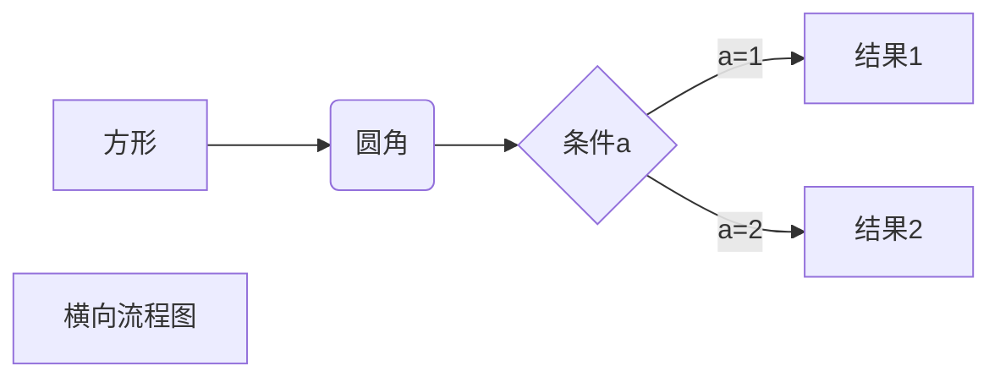

## Markdown

### 一、Markdown标题

#### 1.使用=和-标记一级标题
```
我展示的是一级标题
================

我展示的是二级标题
----------------
```
我展示的是一级标题
================

我展示的是二级标题
----------------

#### 2.使用#标记
使用#号可展示1-6级标题，一级标题对应一个#号，二级标题对应两个#号，依次类推

## 二、段落格式
Markdown没有特殊的段落格式，直接编写文字就好，段落的换行是使用两个以上空格加回车，也可以直接在段落后面使用一个空行来表示重新开始一个段落。

#### 1.字体
Markdown可以使用以下几种字体：
```
*斜体文本*
_斜体文本_
**粗体文本**
__粗体文本__
***粗斜体文本***
___粗斜体文本___
```
效果如下：  
*斜体文本*  
_斜体文本_  
**粗体文本**  
__粗体文本__  
***粗斜体文本***  
___粗斜体文本___  

#### 2.分割线

```
***
* * * 
******
- - - 
------
```
效果如下：
***
* * * 
******
- - - 
------

#### 3.删除线
```
~~del文本~~
```
效果如下：  
~~del文本~~

#### 4.下划线
下划线可以通过 HTML 的 `<u>` 标签来实现：
```
<u>带下划线文本</u>
```
效果如下:

<u>带下划线文本</u>

#### 5.脚注
脚注是对文本的补充说明。
脚注格式如下：
[^要注明的文本]
```
创建脚注格式类似这样 [^脚注]。

```

## 三、列表

支持无序列表和有序列表

#### 1.无序列表使用星号*、+或是-作为列表标记：
```
* 第一项
* 第二项
* 第三项
+ 第一项
+ 第二项
+ 第三项
- 第一项
- 第二项
- 第三项
```
* 第一项
* 第二项
* 第三项
+ 第一项
+ 第二项
+ 第三项
- 第一项
- 第二项
- 第三项

#### 2.有序列表
有序列表为数字加上```.```来表示

1.第一项
2.第二项
3.第三项

#### 3.列表嵌套
1.第一项
- 第一项嵌套的第一个元素
- 第一项嵌套的第二个元素

2.第二项
- 第二项嵌套的第一个元素

## 四、区块
在段落开头使用>符号，然后后面紧跟一个空格符号：

> 区块引用   
>> 第一层嵌套   
>>> 第二层嵌套

#### 1.区块中使用列表
> 区块中使用列表
> 1. 第一项
> 2. 第二项
> + 第一项
> + 第二项
> + 第三项
#### 2.在列表中使用区块
* 第一项
    > 菜鸟教程
    > 学的不仅是技术更是梦想
* 第二项

## 五、代码

如果是段落上的一个函数或者代码片段，可以用反引号包起来` ` `

```
`printf`函数
```
`printf`函数

#### 1.代码区块
使用4个空格或者一个tab，然后换行
    
    <?php
    echo '输出';
    function test() {
    }

也可以使用` ``` `包裹一段代码，并制定一种语言
```javascript
$(document).ready(function() {
    alert('test);
});
```
## 六、链接
使用方法如下：
```
[链接名称](链接地址)
或者
<链接地址>
```

效果如下：
[链接名称](链接地址)
或者
<http://baidu.com>

#### 高级链接
链接也可以用变量代替，文档末尾附带变量地址：
```
这个链接用1作为网址变量[Google][1]
然后在文档的末尾为变量赋值（网址）
[1]: http://www.google.com/
```
这个链接用1作为网址变量   [Google][1]    

[1]: http://www.google.com/

## 七、图片
图片语法格式如下：


例子：


当然你也可以像网址那样对图片网址使用变量

这个链接用 1 作为网址变量 [测试][1].
然后在文档的结尾位变量赋值（网址）

[1]: http://static.runoob.com/images/runoob-logo.png

Markdown 还没有办法指定图片的高度与宽度，如果你需要的话，你可以使用普通的  标签。

## 八、表格
```
|  表头   | 表头  | 表头 |
| : ----  | ----:  | :----:|
| 单元格  | 单元格 | 单元格 |
| 单元格  | 单元格 | 单元格 |
```

|  表头   | 表头  | 表头 |
| :----  | ----:  | :----:|
| 单元格  | 单元格 | 单元格 |
| 单元格  | 单元格 | 单元格 |

#### 1.对齐方式
* -: 设置内容和标题栏居右对齐
* :- 设置内容和标题栏居左对齐
* :-: 设置内容和标题栏居中对齐

## 九、高级技巧
支持的 HTML 元素
不在 Markdown 涵盖范围之内的标签，都可以直接在文档里面用 HTML 撰写。

目前支持的 HTML元素有：
`<kbd> <b> <i> <em> <sup> <sub> <br>`等 ，如

使用 <kbd>Ctrl</kbd>+<kbd>Alt</kbd>+<kbd>Del</kbd> 重启电脑

#### 转义
Markdown 使用了很多特殊符号来表示特定的意义，如果需要显示特定的符号则需要使用转义字符，Markdown 使用反斜杠转义特殊字符：
    
    **文本加粗** 
    \*\* 正常显示星号 \*\*    

**文本加粗**   
\*\* 正常显示星号 \*\*   

Markdown 支持以下这些符号前面加上反斜杠来帮助插入普通的符号
```
\   反斜线
`   反引号
*   星号
_   下划线
{}  花括号
[]  方括号
()  小括号
#   井字号
+   加号
-   减号
.   英文句点
!   感叹号
```

#### 公式
当你需要在编辑器中插入数学公式时，可以使用两个美元符 $$ 包裹 TeX 或 LaTeX 格式的数学公式来实现。提交后，问答和文章页会根据需要加载 Mathjax 对数学公式进行渲染。如：

$$
\mathbf{V}_1 \times \mathbf{V}_2 =  \begin{vmatrix} 
\mathbf{i} & \mathbf{j} & \mathbf{k} \\
\frac{\partial X}{\partial u} &  \frac{\partial Y}{\partial u} & 0 \\
\frac{\partial X}{\partial v} &  \frac{\partial Y}{\partial v} & 0 \\
\end{vmatrix}
$$tep1}{\style{visibility:hidden}{(x+1)(x+1)}}
$$   



